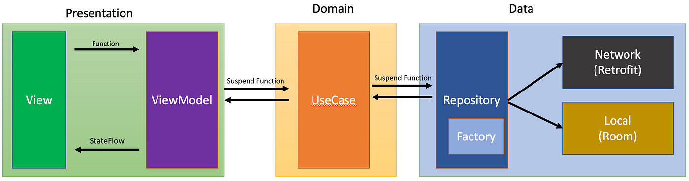

# Situação problema - Android

Lidar com código legado é um desafio. Para isso, desenvolva uma solução para o desafio abaixo e você pode escolher a melhor forma de resolvê-lo, de acordo com sua comodidade e disponibilidade de tempo:
- Resolver o desafio previamente, e explicar sua abordagem.
- Discutir as possibilidades de solução.

Com o passar do tempo identificamos alguns problemas que impedem esse aplicativo de escalar e acarretam problemas de experiência do usuário. A partir disso elaboramos a seguinte lista de requisitos que devem ser cumpridos ao melhorar nossa arquitetura:

- Em mudanças de configuração o aplicativo perde o estado da tela. Gostaríamos que o mesmo fosse mantido.
- Nossos relatórios de crash têm mostrado alguns crashes relacionados a campos que não deveriam ser nulos sendo nulos e gerenciamento de lifecycle. Gostaríamos que fossem corrigidos.
- Gostaríamos de cachear os dados retornados pelo servidor.
- Haverá mudanças na lógica de negócios e gostaríamos que a arquitetura reaja bem a isso.
- Haverá mudanças na lógica de apresentação. Gostaríamos que a arquitetura reaja bem a isso.
- Com um grande número de desenvolvedores e uma quantidade grande de mudanças ocorrendo testes automatizados são essenciais.
  - Gostaríamos de ter testes unitários testando nossa lógica de apresentação, negócios e dados independentemente, visto que tanto a escrita quanto execução dos mesmos são rápidas.
  - Por outro lado, testes unitários rodam em um ambiente de execução diferenciado e são menos fiéis ao dia-a-dia de nossos usuários, então testes instrumentados também são importantes.

Ps.: Fique à vontade para editar o projeto inteiro, organização de pastas e módulos, bem como as dependências utilizadas

## Solução
As regras de negócio foram removidas da view e toda a injeção de dependências passou a ser feita utilizando Koin. Há persistência de dados em um database local e o app mantém seu estado ao reagir a rotações de tela

### Padrão arquitetural
O projeto foi reestruturado para usar o padrão de [arquitetura recomendado pela plataforma](https://developer.android.com/topic/architecture?hl=pt-br)

Essa padrão de separação baseado em layers é utilizado juntamente com o MVVM (model-view-videModel), separando a interface do usuário da lógica de negócios, o que facilita a manutenção e a testabilidade do app
E estrura de camadas [clean + MVVM](https://medium.com/@ami0275/mvvm-clean-architecture-pattern-in-android-with-use-cases-eff7edc2ef76) implementada se relaciona da seguinte forma:

### Tecnologias e contexto de utilização
- Koin -> usado injeção de dependências
- SharedFlow -> usado para emitir eventos da viewmodel para a view
- Retrofit, Gson e OkHTTP -> usado para consumir dados do servidor remoto
- Room -> usado para armazenar dados em um database local
- Junit e Mockk -> usado para construção de testes unitários
- Espresso -> usado para construção de testes de UI